# Meowrauder

<p align="center">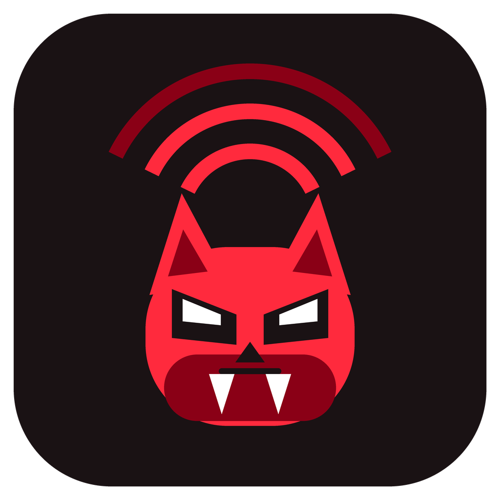</p>

A **Marauder-style RF reconnaissance suite** for the [MeowKit-S3](https://meowkit.cc)
(ESP32-S3) pocket multi-tool, built as a native signed app for the
[FeralCat](https://github.com/FeralDevs/FeralCat) firmware.

> ## ⚠️ Authorised use only
> Everything here except one function is **receive-only** — it listens and
> records. The single active function is the **Evil Twin**, which brings up an
> access point and collects what people type into its portal. It is reachable
> only from an AP you explicitly selected.
>
> Use this on networks and equipment **you own or have written permission to
> assess**. Radio monitoring and frame injection are regulated differently
> depending on where you are; complying with your local law is your
> responsibility.

---

## Screens

| | | |
|:--:|:--:|:--:|
| **Menu** <br>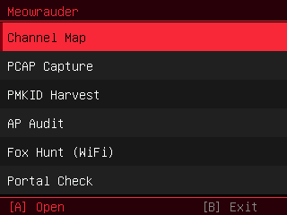 | **Channel Map** <br>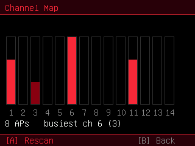 | **PCAP Capture** <br>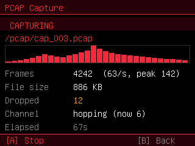 |
| **PMKID Harvest** <br>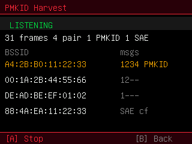 | **AP Audit** <br>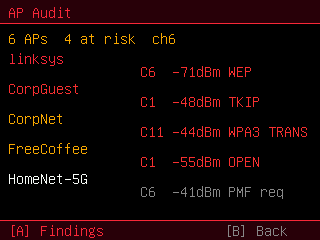 | **AP Audit — findings** <br>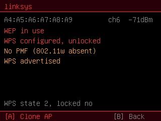 |
| **Fox Hunt — targets** <br>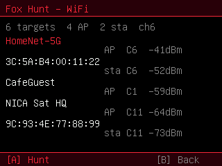 | **Fox Hunt — finder** <br>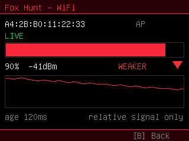 | **Portal Check** <br>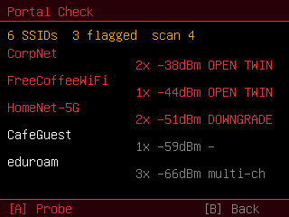 |
| **Portal probe — rogue** <br>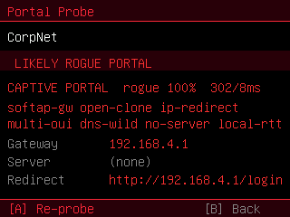 | **Rogue Tools — WiFi** <br>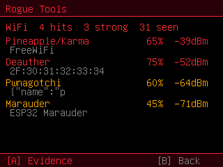 | **Rogue Tools — evidence** <br>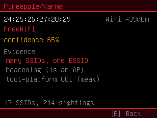 |
| **Rogue Tools — BLE** <br>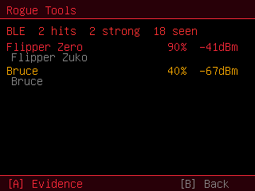 | **Flipper detected** <br>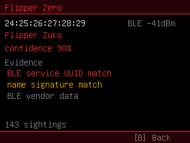 | **Evil Twin** <br>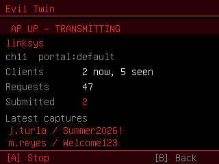 |

Every screenshot is a real render of the app's own drawing code via the
simulator in [`sim/`](sim) — not a mockup. Only the data is synthetic.

## What it does

Meowrauder deliberately implements **only what FeralCat does not**. AP scanning,
probe sniffing, deauth detection, evil-twin twins, BLE-spam detection, tracker
detection and the BLE proximity radar already ship as FeralCat apps
(`wifianalyzer`, `probesniffer`, `deauthdetect`, `rogueradar`, `blespamdetect`,
`trackerdetect`), and MeowGotchi already captures EAPOL handshakes and can
transmit deauth. None of that is duplicated here.

| Screen | What it adds | Radio |
|---|---|---|
| **Channel Map** | 2.4 GHz occupancy histogram, 1/6/11 highlighted, busiest called out — no channel view exists elsewhere | RX |
| **PCAP Capture** | raw **all-frame** capture to `/pcap/cap_NNN.pcap` with a radiotap header carrying channel and per-frame RSSI (MeowGotchi saves EAPOL only) | RX |
| **PMKID Harvest** | pulls the PMKID from the RSN KDE in M1 and writes hashcat `WPA*01` lines to `/pcap/pmkid.22000` | RX |
| **AP Audit** | parses the RSN / WPA1 / WPS elements the scan API discards and reports findings: WPS configured-and-unlocked, PMF not required, WPA3 transition mode, TKIP, WEP, hidden SSID | RX |
| **Fox Hunt (WiFi)** | follow one AP or station by filtered signal strength — the existing radar is BLE-only | RX |
| **Portal Check** | temporal evil-twin flags, an **active captive-portal probe**, and a weighted **rogue score** that separates a hostile portal from a legitimate one; nothing in FeralCat associates, so nothing else can detect a portal at all | RX + probe |
| **Rogue Tools** | find Flipper Zero, Bruce, Pwnagotchi, WiFi Pineapple and deauthers nearby, on both radios | RX |
| **Evil Twin** | open SoftAP + DNS hijack + captive portal, for authorised social-engineering assessments | **TX** |

### Rogue Tools reports evidence, not verdicts

Each hit carries the signals that produced it and a confidence built from how
many independent ones agree. An **Espressif OUI can never raise a hit** — every
ESP32 shares those prefixes, including the device you are holding — so it is
worth only corroboration. Behaviour is what counts: one BSSID advertising many
SSIDs is Karma, and a station emitting deauth is attacking whatever it calls
itself. The detail screen labels the OUI row `(weak)` so you can see the
reasoning rather than trust a badge.

### Scope

Implemented: reconnaissance, detection, assessment, and one active capability —
the evil twin, which is targetable (one SSID, one site, reaching only people who
choose to connect) and reachable only from an explicitly selected AP.

Not implemented: beacon spam (including Rick Roll and AP clone), probe request
flood, untargeted deauth flood, Karma, Bad Message, association sleep, SAE
commit flood, channel switch, and quiet time. Those are denial-of-service that
works by degrading every station in radio range, so an engagement's
authorisation cannot cover the third parties they hit.

## Install

You need a MeowKit-S3 running [FeralCat](https://github.com/FeralDevs/FeralCat)
**v0.11.0 or newer**, with the firmware side of this repo applied (it adds the
capture engines and the ABI they are reached through).

**1. Apply the firmware overlay and build**

```bash
export FERALCAT_ROOT=/path/to/FeralCat
tools/install.sh                       # copies modules + applies patches
cd "$FERALCAT_ROOT"
git submodule update --init --recursive --depth 1     # easy to forget
docker build -t meowkit-pio:local docker/
docker run --rm -v meowkit-pio:/root/.platformio -v "$PWD":/work meowkit-pio:local run
```

**2. Install on the device** — copy `.pio/build/esp32s3box/firmware.bin` to the
SD card root and use **Firmware → Update from SD → A**. No cable needed; it
goes through the dual-OTA slots so a bad write rolls back.

**3. Install the app** — copy [`app/`](app) to `/apps/meowrauder` on the SD card
(`app.elf` + `manifest.ini` are the only required files), then **restart the
device** — the launcher scans the card at boot.

**4. Signing** — the prebuilt `app.elf` here is **unsigned**. FeralCat verifies
native apps against a public key baked into its firmware, and the matching
private seed is maintainer-only, so a third party cannot produce a signature it
accepts. Either enable **Settings ▸ Features ▸ Allow unsigned apps**, or rotate
FeralCat to your own key (`tools/app_signing/meowsign keygen`, paste the printed
`APP_SIGN_PUBKEY` into `src/system/app_sign.cpp`, rebuild, re-sign every app).

**5. Evil Twin** — brings up a real AP and logs plaintext submissions to
`/portal/captures.csv`. Run it only under an engagement whose scope covers
social-engineering testing, and treat that file as the most sensitive artefact
of the test: pull it off the card and destroy it after reporting.

## Build the app yourself

```bash
export FERALCAT_ROOT=/path/to/FeralCat
tools/build_app_local.sh app           # host xtensa-esp32s3-elf toolchain
```

`-O0 -fno-merge-constants` is not a mistake: FeralCat's ELF loader captures
`.rodata` by name and cannot handle the merged-string rodata `-O1+` produces,
nor the jump tables it emits. See [`app/../firmware/README.md`](firmware/README.md).

## Simulator

Renders the app's real screens on a PC — no hardware, no flashing.

```bash
docker build -t meowkit-sim:local -f docker/Dockerfile.sim docker/
docker run --rm -v "$PWD":/work -v "$FERALCAT_ROOT":/feralcat -w /work meowkit-sim:local bash -c '
  cmake -S sim -B sim/build -DFERALCAT_ROOT=/feralcat -DAPP_SRC=app/app_main.c
  cmake --build sim/build -j
  SDL_VIDEODRIVER=dummy sim/build/meowkit-app --keys "D,D,A" --idle 8 --out shot.bmp'
```

`--keys` scripts button input (`U/D/L/R/A/B` tap, `b` hold-B to exit, `.` idle).
Every `mk_gfx_present()` writes the BMP. See [`sim/README.md`](sim/README.md).

## Status

Verified in three stages — *compiles*, *runs in the simulator*, *confirmed on
hardware*. 

| Module | Hardware |
|---|---|
| launcher app-detection fix, app, icon | ✅ |
| `wifi_audit` | ✅ correct IE parse on a real WPA2/WPA3-mixed hidden AP |
| `pcap_capture` | ✅ 536 packets, 0 malformed, radiotap valid throughout |
| `eapol_capture` | ✅ complete WPA2 four-way handshake |
| `evil_twin` | ✅ full chain incl. the OS captive-portal sheet |
| `wifi_fox` | ✅ |
| `tool_detect` | ✅ BLE (real Flipper Zero) and WiFi (a live rogue SoftAP); stable across mode toggles |
| `portal_detect` | ✅ enumerates 6 APs incl. a live rogue; rogue scoring confirmed against a standalone bait AP |

Every module above is confirmed against real signals. Two *paths inside*
confirmed modules have not been exercised, and are called out so the table is
not read as more than it says:

- **Evil-twin scoring** in `portal_detect`. The rogue score is confirmed
  against a live standalone bait AP, but that AP had no secured twin, so
  `open-clone`, `multi-oui` and `signal-jump` never fired. Those three weights
  are reasoned rather than measured.
- **`tool_detect`'s Pineapple/Karma, Pwnagotchi and deauther detectors.**
  The Flipper and rogue-SoftAP paths are confirmed; these three have never
  matched anything real.

Firmware builds clean: `[SUCCESS]`, RAM 42.7%, Flash 80.1%
(6,667,616 of 8,323,072 B). Real device output is in
[`docs/samples/`](docs/samples): a well-formed pcap, the 41-AP survey that
rejected three proposed rogue signals, and a healthy Portal Check scan log.

**Eleven bugs were found on hardware and none of them were findable in the
simulator** — every one was a gap between what an API promised and what it did.
Three were self-inflicted: the fix for a stack overflow starved the Bluetooth
controller by moving ~20 KB into internal RAM; moving those buffers to PSRAM
then put a `malloc` on an ISR callback path, which was the real cause of a
reboot that four earlier theories had failed to explain; and the BLE teardown
took four attempts of its own. See [CHANGELOG](CHANGELOG.md) for the full
list, which is worth reading before extending any of this.

The two longest-running bugs were both solved by instrumentation, not
reasoning — RTC breadcrumbs that survive a panic, and scan telemetry written
to the SD card. This board's USB CDC produced nothing across ~85 s of capture
with DTR and then DTR+RTS asserted, so serial is not a usable channel: build
the debug path deliberately and early.

Known weakness: several `esp_wifi_*` and `esp_ble_*` calls still go unchecked.
Every one that can fail should have its return inspected — silent failure was
the root of more than one of those nine.

## Credits

- **[ESP32 Marauder](https://github.com/justcallmekoko/ESP32Marauder)** by
  *Just Call Me Koko* (MIT) — the project this follows. Its function list shaped
  what Meowrauder implements. **No Marauder code is used here**; every module is
  written against FeralCat's own ABI.
- **[FeralCat](https://github.com/FeralDevs/FeralCat)** — the firmware this
  extends, and the origin of the `mk_app` ABI, `MK_TUI` toolkit and the
  `TrackerFinder` signal-following logic that Fox Hunt reuses for WiFi.
- **[MeowKit](https://github.com/mingolucky/meowkit-s3-firmware)** by
  *mingolucky* — the upstream open-source firmware.


